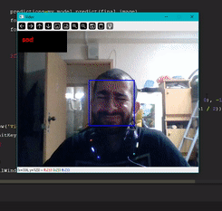

# FeelingsDetector
Engaging in this comprehensive project, the aim is to develop an End-2-End solution that incorporates real-time emotion detection for both videos and photos. Additionally, the system will provide personalized song recommendations. Furthermore, the project involves deploying the solution on a cloud platform and mobile applications.

## TODO
- [] improve code readabilty 
- [] solve overfitting
- [] Add blinks counter
- [] Add music recommender based on emotions
- [] improve accuracy
- [] deploy model to cloud
- [] deploy model to and android app
